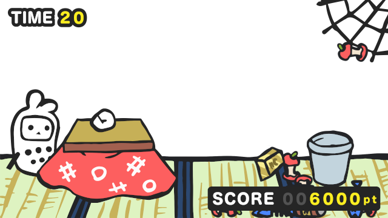

ゴミをゴミ箱に入れるだけのゲーム
=============

[Akashic Engine](https://akashic-games.github.io/) で作られたゲームです。



## ビルドと実行方法

TypeScriptで作られています。以下のコマンドで、このリポジトリをクローンしてビルドしてください。

```sh
git clone git@github.com:akashic-contents/akashic-trash.git
cd akashic-trash
npm install
npm run build
```

以下のコマンドで akashic-sandbox が起動されます。実行後、 `http://localhost:3000/` にアクセスしてください。

```sh
npm start
```

## パラメータ

```javascript
{
    "type": "start",
    "parameters": {
        /**
         * ゲームの制限時間。
         */
        "totalTimeLimit": 92,
        /**
         * ゲームの難易度。
         * 0～3 : クモが出現しません
         * 4～7 : クモが途中から出現します
         * 8～10: クモが常に出現します
         */
        "difficulty": 4
    }
}
```

## ライセンス

本リポジトリは MIT License の元で公開されています。
詳しくは [LICENSE](./LICENSE) をご覧ください。

ただし、画像ファイルおよび音声ファイルは
[CC BY 2.1 JP](https://creativecommons.org/licenses/by/2.1/jp/) の元で公開されています。
